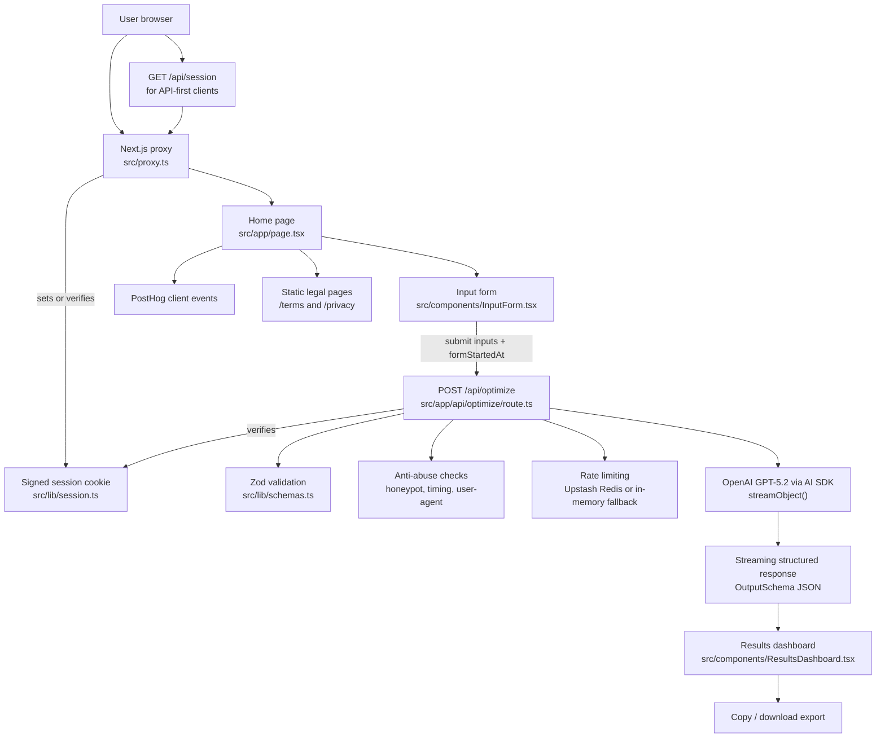

# ResumeTailor

Tailor your resume and LinkedIn profile to any job description. The app analyzes job postings, identifies gaps, and generates tailored content and resume recommendations powered by OpenAI.

## Architecture



## How It Works

1. A visitor lands on the Next.js app, and `src/proxy.ts` ensures a signed `session_token` cookie exists before the page or API routes continue.
2. The home page renders `InputForm`, where the user provides their current role, target role, job description, and resume text.
3. On submit, the client sends the payload to `POST /api/optimize` using the AI SDK's `useObject()` hook, which supports streaming structured data back into the UI.
4. The optimize route validates the request with Zod, checks anti-bot signals (honeypot field, suspiciously fast submissions, and bot-like user agents), and applies rate limiting.
5. If the request passes those checks, the server calls OpenAI with `streamObject()` and forces the model output to match `OutputSchema`.
6. The streamed response is rendered progressively in `ResultsDashboard` across three areas: job description analysis, LinkedIn optimization, and resume optimization.
7. The client also records key product events with PostHog and lets the user copy individual sections, copy everything, or download a text export.

## Getting Started

1. Copy environment variables and fill in values:

   ```bash
   cp .env.example .env
   ```

2. Install dependencies and run the dev server:

   ```bash
   npm install
   npm run dev
   ```

3. Open [http://localhost:3000](http://localhost:3000) in your browser.

## Required Environment Variables

See [.env.example](.env.example) for the full list. Summary:

| Variable | Required | Description |
|----------|----------|-------------|
| `OPENAI_API_KEY` | Yes | API key for OpenAI (model calls). |
| `UPSTASH_REDIS_REST_URL` | Production | Upstash Redis REST URL for rate limiting. |
| `UPSTASH_REDIS_REST_TOKEN` | Production | Upstash Redis REST token. |
| `SESSION_SECRET` | Production | Secret for signing session cookies (min 16 chars). |

In **production**, Upstash and `SESSION_SECRET` are required; the app will fail fast if they are missing. For **local development**, only `OPENAI_API_KEY` is required; rate limiting uses an in-memory fallback and a dev session secret when `SESSION_SECRET` is unset.

If you see an **internal error or 503** when visiting the app in an incognito window (or on first visit), the server cannot create a session cookie—set `SESSION_SECRET` in your environment (production) or run with `npm run dev` (development uses a built-in secret).

## Deployment

1. Set all required environment variables in your host (e.g. Vercel project settings).
2. Ensure `UPSTASH_REDIS_REST_URL`, `UPSTASH_REDIS_REST_TOKEN`, and `SESSION_SECRET` are set in production.
3. Build and start:

   ```bash
   npm run build
   npm start
   ```

For more details, see [Next.js deployment documentation](https://nextjs.org/docs/app/building-your-application/deploying).

## Learn More

- [Next.js Documentation](https://nextjs.org/docs)
- [Next.js Deployment](https://nextjs.org/docs/app/building-your-application/deploying)
